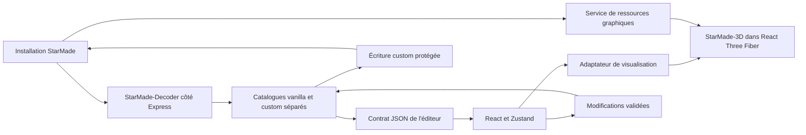

# Audit initial — StarMade-BlockEditor, StarMade-3D et StarMade-Decoder

Date : 23 septembre 2026. Périmètre corrigé par l'utilisateur : **StarMade-Decoder**, pas StarMade-DB. Cet audit prépare l'intégration ; il ne constitue pas une livraison de celle-ci.

## Conclusion

La reprise peut conserver React, les panneaux d'édition, Zustand et l'API Express. Les deux bibliothèques cibles fournissent déjà les principales fonctions nécessaires. Le chantier porte surtout sur le remplacement du parseur/sérialiseur et du rendu maison, les contrats de données, les ressources graphiques et la protection des écritures.

**L'éditeur actuel n'est pas conforme aux critères de livraison demandés.** Une compilation réussie ne qualifie ni la préservation des données ni le rendu réel. La couverture comporte des exclusions et aucun seuil bloquant ; les tests graphiques remplacent le moteur par des mocks.

## Versions et état des dépôts

Les branches et tags distants ont été consultés avec `git ls-remote --heads --tags origin`, sans fetch, pull ni changement de branche.

| Projet | Version du manifeste | Commit local = main distant | Distribution vérifiée |
| --- | --- | --- | --- |
| BlockEditor | 1.0.0 | `da4cf1aff4a18d5b10ec42735ca2280cf441f535` | Tag `v1.0.0` sur ce commit |
| StarMade-3D | 1.0.0 | `bb80c2ebaccf262e944925a807671e67e4e15ac5` | Tag `v1.0.0` sur ce commit ; npm public retourne E404 |
| StarMade-Decoder | 2.0.0 | `4cb21bd72258c87eb8115f90449a8334c34658a6` | Dernière source distante ; seul tag distant `v1.0.0` ; npm public retourne E404 |

La cible Decoder est donc **la source 2.0.0 au commit vérifié**, pas un hypothétique paquet npm publié sous cette version. Préparer des artefacts construits et épinglés, avec qualification d'installation dans un consommateur propre. Un lien `file:../...` peut servir au développement local mais ne suffit pas à rendre la distribution autonome.

BlockEditor et StarMade-3D étaient propres à l'ouverture. Decoder comporte une suppression préexistante de `starmade-decoder-1.0.0.tgz`, laissée intacte. Aucun code applicatif, fichier du jeu ni service existant n'a été modifié pendant l'audit. Le seul ajout dans BlockEditor est ce rapport.

## Architecture à retenir

Decoder reste côté serveur : ses exports ESM utilisent `fs`, `path` et des codecs Node. Le navigateur reçoit un contrat JSON explicite. StarMade-3D reste côté client et partage l'instance de Three.js avec React Three Fiber. Les définitions chargées par Decoder restent conservées côté serveur pour maintenir leurs informations XML d'origine.

## Constats prioritaires

### P1 — Versions graphiques et ressources natives

BlockEditor déclare Three `^0.166.1` et ses types `^0.166.0`, contre un peer `^0.164.1` pour StarMade-3D. Ces plages ne se recouvrent pas. Le chemin déjà qualifié est Three **0.164.1**, **WebGL2** et un environnement d'outillage **Node >=22.16.0**. Le README de l'éditeur indiquant Node 18+ doit être corrigé lors de l'intégration. Sources : [client/package.json](/srv/dev/StarMade-BlockEditor/client/package.json:18), [contrat 3D](/srv/dev/StarMade-3D/docs/api-stability.md:11).

Le package 3D ne contient pas les shaders, textures ou modèles du jeu. Il faut fournir le corpus shader via `loadStarMadeShaderSources`/`setStarMadeShaderSources`, puis les couches diffuse/normale, overlays et ressources LOD nécessaires depuis l'installation sélectionnée. Le serveur exemple de StarMade-3D n'est pas un service implicite du package. Source : [assets.md](/srv/dev/StarMade-3D/docs/assets.md:3).

### P1 — Adaptation Decoder et préservation XML

| Contrat actuel BlockEditor | Contrat Decoder / représentation à adapter |
| --- | --- |
| `textureId` | `textureIds` |
| `transparency` | `transparent` |
| `extendedTexture4x4` | `extendedTexture` |
| `onlyDrawnInBuildMode` | `drawOnlyInBuildMode` |
| `lodShapeFromFar` | `lodShapeStyle`, avec autres champs LOD |
| `door`, `effectArmor` | `metadata.door`, `metadata.effectArmor` |
| Recettes, chambres, collisions dans `extraProperties` | Champs typés et `metadata` ; `extraProperties` ne contient que les extensions inconnues |
| `isCustom` | Provenance à conserver dans le service éditeur |

Une affectation directe `extraProperties = definition.extraProperties` ferait disparaître des propriétés avancées de l'interface. Il faut un mapping bidirectionnel, partagé et vérifié, au lieu des deux interfaces `BlockDef` actuellement dupliquées client/serveur. Sources : [panneaux avancés](/srv/dev/StarMade-BlockEditor/client/src/components/layout/advancedProperties.tsx:111), [métadonnées Decoder](/srv/dev/StarMade-Decoder/src/config/BlockConfig.ts:1928).

Decoder conserve certains attributs et sous-arbres XML d'origine dans une `WeakMap`, propagée par `.with(...)`. Ils ne sont pas transportés par JSON. Une probe en mémoire a confirmé que `.with({hp:101})` préserve des attributs inconnus de `Hitpoints` et `Consistence/Item`, tandis qu'une reconstruction `JSON` → `BlockDefinition.create()` les perd et ajoute des champs par défaut. Garder les instances originales, valider les modifications reçues et leur appliquer des patches. Réserver `create()` aux nouveaux blocs. Sources : [source XML](/srv/dev/StarMade-Decoder/src/config/BlockConfig.ts:589), [with](/srv/dev/StarMade-Decoder/src/config/BlockConfig.ts:887).

`BlockConfig.load()` fusionne vanilla et custom. Conserver deux catalogues séparés pour l'origine, la suppression d'un override et la réapparition de sa définition vanilla. `saveCustom()` ne conserve que les différences, donc un override identique au vanilla disparaît. `saveAll()` sur le catalogue fusionné recopierait tous les blocs dans le fichier custom. Aucun de ces raccourcis ne doit remplacer aveuglément le comportement actuel. Sources : [load](/srv/dev/StarMade-Decoder/src/config/BlockConfig.ts:1602), [écriture](/srv/dev/StarMade-Decoder/src/config/BlockConfig.ts:1773).

Les sorties XML sont reconstruites sous `General/Custom` : ne pas promettre une conservation intégrale du document, de ses catégories ou de ses octets. Les noms symboliques nouveaux nécessitent une stratégie de mapping XML/properties ; les méthodes custom emploient des IDs numériques. Le générateur d'ID actuel `max+1` doit aussi respecter les bornes et collisions : `BlockConfig.fromBlocks()` accepte les IDs 1 à 4094 et rejette les identités dupliquées.

### P1 — Protection des sauvegardes et ressources d'origine

L'éditeur réécrit directement `BlockConfigImport.xml` par `writeFileSync`, sans fichier temporaire, remplacement atomique, sauvegarde ni contrôle de modification externe. Les méthodes d'écriture de Decoder ne fournissent pas davantage ces garanties. Les ajouter dans le service de persistance de l'éditeur. Sources : [writer actuel](/srv/dev/StarMade-BlockEditor/server/src/api/blocks.ts:813), [writer Decoder](/srv/dev/StarMade-Decoder/src/config/BlockConfig.ts:1782).

L'import d'icône modifie **`data/image-resource/build-icons-...png`**, une ressource du jeu, directement et sans sauvegarde. L'affirmation de préservation des fichiers d'origine ne s'étend donc pas aux icônes. Définir une destination custom reconnue par le jeu ou une procédure explicite de sauvegarde/restauration avant de qualifier ce parcours. Sources : [chemin icône](/srv/dev/StarMade-BlockEditor/server/src/api/textures.ts:425), [écriture icône](/srv/dev/StarMade-BlockEditor/server/src/api/textures.ts:613).

Les routes PUT/POST acceptent de nombreux champs sans validation complète des types, plages ou tableaux. Un `...req.body` n'est pas un schéma validé ; le DTO TypeScript ne protège pas l'API HTTP. Source : [routes blocs](/srv/dev/StarMade-BlockEditor/server/src/api/blocks.ts:904).

### P1 — Fidélité des textures et des faces

L'atlas composite de l'éditeur est une image de 64×32 tuiles ; le shader natif attend des couches de 16×16. Les tuiles custom gardent les IDs 1792–2047, sur la couche 7. Le composite peut rester utile au sélecteur, mais ne doit pas être branché directement au shader natif.

Le serveur actuel ne lit que des PNG directs et compose les normales avec alpha-over sur un fond opaque. Or le canal alpha des normales StarMade contient des informations de matériau nécessaires à l'émission/spéculaire ; il faut conserver le RGBA original, y compris depuis les archives TGA employées par le jeu. Une reproduction avec sharp a transformé `[20,30,40,64]` en `[100,103,201,255]` : l'alpha est perdu et le RGB est également altéré. Sources : [pages](/srv/dev/StarMade-BlockEditor/server/src/api/textures.ts:202), [composition](/srv/dev/StarMade-BlockEditor/server/src/api/textures.ts:308), [ressources 3D](/srv/dev/StarMade-3D/scripts/block-texture-asset.mjs:4).

`individualSides=3` est interprété comme trois paires de faces dans l'éditeur. Le contrat natif distingue dessus, dessous et quatre côtés communs. L'intégration doit corriger le sélecteur et ses assertions à partir du contrat métier vérifié, avec des textures contrastées sur chaque face. Il ne s'agit pas de modifier un oracle pour améliorer le taux de réussite. Sources : [sélecteur](/srv/dev/StarMade-BlockEditor/client/src/components/editor/FaceSelector.tsx:79), [ancienne géométrie](/srv/dev/StarMade-BlockEditor/client/src/3d/geometries/CubeGeom.ts:46), [règle native](/srv/dev/StarMade-3D/src/starmade/blockConfig.ts:377).

### P2 — Chargement initial, caches et états

- Une installation sans `customBlockTextures/256/custom.png` est déclarée invalide, même si `BlockConfig.xml` existe. L'absence de ressources custom doit être un état initial normal. [config.ts](/srv/dev/StarMade-BlockEditor/server/src/api/config.ts:149).
- Les caches atlas et icônes ne sont pas indexés par installation ; un changement de dossier peut conserver des images de l'installation précédente. Le rendu observe taille, pack et validité, sans observer le chemin. [textures.ts](/srv/dev/StarMade-BlockEditor/server/src/api/textures.ts:334), [BlockViewer.tsx](/srv/dev/StarMade-BlockEditor/client/src/3d/BlockViewer.tsx:167).
- Le retour anticipé du cache blocs ne vérifie pas le mtime de `BlockTypes.properties`, malgré la documentation. Un changement de mapping seul peut ne pas être relu. [blocks.ts](/srv/dev/StarMade-BlockEditor/server/src/api/blocks.ts:638).
- Après suppression d'un override, le client retire le bloc de la liste sans rétablir immédiatement le vanilla ; un rechargement rétablit l'état serveur. [useApi.ts](/srv/dev/StarMade-BlockEditor/client/src/hooks/useApi.ts:227).
- Les lectures et la création ne contrôlent pas toutes `res.ok` avant d'utiliser le JSON. [useApi.ts](/srv/dev/StarMade-BlockEditor/client/src/hooks/useApi.ts:136), [création](/srv/dev/StarMade-BlockEditor/client/src/hooks/useApi.ts:269).
- Un atlas 256 px/tuile fait 16384×8192 pixels, soit 512 Mio RGBA brut par carte ; diffuse et normale représentent 1 Gio avant buffers supplémentaires. Charger les seules couches nécessaires et mesurer les changements répétés de bloc/pack.

### Exposition de l'application

`app.listen(PORT)` n'impose pas de boucle locale, les routes d'écriture ne sont pas authentifiées et CORS est ouvert en développement. Pour un outil local, imposer une écoute locale et contrôler l'origine des mutations ; un déploiement partagé exige une authentification et des permissions explicites. Ceci découle des routes effectivement présentes, sans tentative d'exploitation durant l'audit. Source : [index.ts](/srv/dev/StarMade-BlockEditor/server/src/index.ts:142).

## Adaptateur de rendu proposé

Conserver la caméra, R3F et les commandes d'édition. Remplacer le moteur maison par les exports publics suivants :

- `blockDefinitionFromConfig` ou `blockDefinitionFromElementInfo` pour transformer une projection conforme de Decoder ;
- `createStarMadeEncodedCubeGeometry` pour forme, orientation, slab et état d'activation ;
- `createStarMadeCubeShaderMaterial` pour le rendu natif et `updateStarMadeCubeShaderTime` pour son animation ;
- `updateStarMadeCubeShaderClipPlanes` et, selon le montage, `updateStarMadeCubeShaderMVP` pour les données dépendant de la caméra ;
- les fonctions de résolution/chargement/instanciation LOD pour les blocs concernés.

Ne pas utiliser `createPreviewScene` comme remplacement complet : il fournit un aperçu simplifié. Ne pas réappliquer le quaternion et le scale slab maison à une géométrie qui les encode déjà. Le shader natif nécessite ses propres données d'éclairage ; les lumières R3F actuelles ne suffisent pas à renseigner ses uniforms.

Définir un propriétaire pour chaque texture, matériau et géométrie, annuler ou ignorer les chargements devenus obsolètes, et libérer les ressources au bon moment. Qualifier les erreurs d'assets, les changements d'installation et la mémoire sur plusieurs changements de bloc. Sources : [géométrie native](/srv/dev/StarMade-3D/src/geometry/starmadeEncodedCube.ts:466), [matériau et animation](/srv/dev/StarMade-3D/src/shaders/cubeShaderMaterial.ts:1759), [gestionnaire de ressources](/srv/dev/StarMade-3D/src/inspection/resources.ts:9).

Le manifeste de ressources doit distinguer assets obligatoires et facultatifs : `loadStarMadeCubeTexturePack` demande custom et overlays par défaut, mais ignore les échecs de chargement des normales. Traiter explicitement une installation sans custom et signaler un rendu dégradé. Source : [cubeAtlas.ts](/srv/dev/StarMade-3D/src/textures/cubeAtlas.ts:39).

## Validation de l'audit

### BlockEditor : résultats exécutés aujourd'hui

Copie jetable du commit audité dans `/tmp/starmade-blockeditor-audit-20260923-s1mmb4ns/repo`, Node 20.20.2, npm 10.8.2, installation par `npm ci` à partir du lock existant. Aucun changement d'oracle, de seuil ou de configuration source. Les premières exécutions sandbox ont été empêchées par l'interdiction d'ouvrir les sockets Supertest (`EPERM`) ; tests et couverture ont ensuite été relancés avec les sockets HTTP éphémères autorisées.

| Contrôle | Résultat mesuré |
| --- | --- |
| `npm run docs:check` | PASS, 38 fichiers source |
| `npm run build` | PASS, serveur TypeScript et client TypeScript/Vite |
| `npm test` | PASS, 20 tests serveur + 151 tests client, 25 fichiers de tests |
| `npm run coverage` | Code de sortie 0, mais **NON CONFORME** au critère 100 % |
| Serveur, lignes | 418/469 = 89,12 % |
| Serveur, branches | 259/313 = 82,74 % |
| Client, lignes | 1061/1183 = 89,68 % |
| Client, branches | 725/795 = 91,19 % |
| Contrôle externe par fichier | **ÉCHEC**, code 1 ; 21 des 36 fichiers rapportés sous 100 % lignes ou branches |

Les configurations excluent déjà `server/src/index.ts` et `client/src/main.tsx`. Des directives `c8 ignore` existent dans les panneaux d'édition. Le contrôle externe ne les légitime pas et les chiffres ci-dessus ne couvrent donc pas tout le code exécutable exigé. Aucun seuil bloquant n'est configuré dans les scripts actuels, et aucun workflow CI n'a été trouvé dans BlockEditor. Sources : [configuration serveur](/srv/dev/StarMade-BlockEditor/server/vitest.config.ts:9), [configuration client](/srv/dev/StarMade-BlockEditor/client/vitest.config.ts:15).

Reproductions complémentaires sur fixtures temporaires :

- installation contenant `BlockConfig.xml` mais sans `custom.png` : rejet confirmé ;
- composition de normale : altération RGBA confirmée comme décrite plus haut ;
- PUT d'icône : réponse HTTP 200 et changement du SHA-256 de la feuille d'icônes d'origine dans la fixture.

`npm audit --json` signale **17 dépendances affectées** dans le graphe complet : 1 critique, 7 élevées, 7 modérées, 2 faibles. L'audit production séparé (`--omit=dev`) signale **4 dépendances** : `sharp` élevée ; `body-parser`, `fflate` et `qs` modérées ; aucune critique. Ce sont des signalements de dépendances, pas une démonstration d'exploitabilité de tous les avis dans l'application. Prévoir la mise à jour et sa recette ; aucun `npm audit fix` n'a été exécuté.

Preuves locales : [commandes reproductibles](/tmp/starmade-blockeditor-audit-20260923-s1mmb4ns/README.md), [tests](/tmp/starmade-blockeditor-audit-20260923-s1mmb4ns/logs/test-network.log), [build](/tmp/starmade-blockeditor-audit-20260923-s1mmb4ns/logs/build.log), [couverture](/tmp/starmade-blockeditor-audit-20260923-s1mmb4ns/logs/coverage-network.log), [contrôle par fichier](/tmp/starmade-blockeditor-audit-20260923-s1mmb4ns/coverage-gate.json), [script du contrôle](/tmp/starmade-blockeditor-audit-20260923-s1mmb4ns/coverage-gate.py), [reproductions](/tmp/starmade-blockeditor-audit-20260923-s1mmb4ns/logs/behavior-reproductions.json), [audit production](/tmp/starmade-blockeditor-audit-20260923-s1mmb4ns/logs/npm-audit-production.json). Ces fichiers sont dans un répertoire temporaire ; les résultats essentiels sont conservés dans ce rapport.

Aucune recette navigateur/WebGL de BlockEditor n'a été exécutée : ses tests 3D emploient des mocks et ne prouvent pas la fidélité des pixels. Cette validation fait partie du chantier d'intégration.

### Bibliothèques : preuves existantes et contrôles actuels

- **StarMade-3D** : campagne documentée du 23/09, 763 tests runtime, 3 intégrations Decoder, 12 recettes assets et 41 régressions WebGL ; couverture de 46 modules, 11168/11168 lignes et 3783/3783 branches. `node scripts/release-check.mjs` a été relancé pendant cet audit : PASS, avec correspondance des empreintes sources. Les campagnes GPU complètes n'ont pas été relancées. [Qualification 3D](/srv/dev/StarMade-3D/docs/v1-validation.md:11).
- **Decoder** : campagne documentée du 20/09, 1477 tests sans échec ni attente ; 121 modules, 28347/28347 lignes et 8808/8808 branches. Le rapport local a les mêmes compteurs. La CI documente séparément 1430 réussites et 47 tests en attente faute d'assets. Pendant cet audit, import du module construit et chargement en lecture seule de **1516 blocs** depuis l'installation, plus la probe de préservation XML en mémoire. Suite complète non relancée. [Qualification Decoder](/srv/dev/StarMade-Decoder/docs/V2_QUALIFICATION.md:3).

Ces preuves qualifient leurs périmètres respectifs, **pas l'intégration dans BlockEditor**. Aucun lancement du jeu ni import dans le jeu n'a été effectué.

## Ordre de reprise et critères de sortie

1. **Rétablir un socle vérifiable** : épinglage des deux artefacts, runtime Node commun, Three/types alignés, dépendances corrigées, commande de validation et CI bloquantes. Qualifier la dette existante sans annoncer un PASS global.
2. **Introduire Decoder** : contrat JSON, mapping de tous les panneaux, catalogues d'origine distincts, validation des patches/IDs, sauvegarde protégée et invalidation correcte. D'abord les tests de lecture → édition → sauvegarde → relecture sur copies jetables.
3. **Introduire StarMade-3D** : ressources natives, adaptateur R3F, faces et orientations, styles 0–6/slabs, activation, animation, transparence, émission, LOD et contrôle de la mémoire. Vérifier le rendu réel dans un navigateur WebGL2.
4. **Recette complète** : installation vierge sans custom, overrides/création/suppression, propriétés avancées et extensions XML, import atlas/icônes, changement d'installation, erreur d'écriture sans perte, comparaison visuelle et rechargement persistant.

Exigence de livraison : **100 % lignes et branches par fichier sur le périmètre requis, avec rapport exact et contrôle bloquant**. Ne pas ajouter d'exclusions ni d'ignore pour faire passer la couverture ; qualifier et résorber les exclusions legacy. Les assertions métier, tests de persistance et recettes navigateur restent nécessaires indépendamment du pourcentage.

## Conditions d'exécution

Trois analyses parallèles bornées ont été utilisées : bibliothèques en lecture seule et validation de l'éditeur dans une copie jetable. Le rédacteur de ce rapport est unique et enregistré dans le store commun de leases. Le pack workflow v0.5 et `/srv/dev/agent-workflow/README.md` indiqués par les consignes ne sont pas présents sur cette machine ; aucun développement par lots n'a été engagé sur leur base.

Aucun commit, push, changement de dépendance dans les dépôts, redémarrage de service ou écriture dans l'installation StarMade n'a été effectué.
