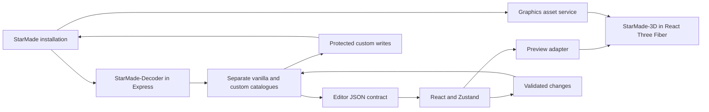

# Initial audit — StarMade-BlockEditor, StarMade-3D and StarMade-Decoder

Date: September 23, 2026. Scope corrected by the user: **StarMade-Decoder**, not StarMade-DB. This audit prepares the integration; it is not a delivery of that integration.

## Conclusion

The existing React interface, editing panels, Zustand stores and Express API can be retained. Both target libraries already provide the main capabilities required. Most of the work involves replacing the custom parser/serializer and renderer, adapting data contracts, serving graphical resources and protecting writes.

**The editor at the time of this audit does not meet the requested delivery criteria.** A successful build qualifies neither data preservation nor actual rendering. Coverage includes exclusions and has no blocking threshold; graphics tests replace the renderer with mocks.

## Versions and repository state

Remote branches and tags were inspected with `git ls-remote --heads --tags origin`, without fetching, pulling or switching branches.

| Project | Manifest version | Local commit = remote main | Verified distribution |
| --- | --- | --- | --- |
| BlockEditor | 1.0.0 | `da4cf1aff4a18d5b10ec42735ca2280cf441f535` | Tag `v1.0.0` points to this commit |
| StarMade-3D | 1.0.0 | `bb80c2ebaccf262e944925a807671e67e4e15ac5` | Tag `v1.0.0` points to this commit; public npm returns E404 |
| StarMade-Decoder | 2.0.0 | `4cb21bd72258c87eb8115f90449a8334c34658a6` | Latest remote source; only remote tag is `v1.0.0`; public npm returns E404 |

The Decoder target is therefore **the 2.0.0 source at the verified commit**, not an assumed npm package published under that version. Prepare built, pinned artifacts and qualify installation in a clean consumer. A `file:../...` reference can support local development but does not make the distribution self-contained.

BlockEditor and StarMade-3D were clean when opened. Decoder contains a pre-existing deletion of `starmade-decoder-1.0.0.tgz`, which was preserved. No application code, game file or existing service was modified during the audit. This report was the only addition to BlockEditor.

## Proposed architecture

Decoder stays on the server: its ESM exports use `fs`, `path` and Node codecs. The browser receives an explicit JSON contract. StarMade-3D stays on the client and shares the Three.js instance used by React Three Fiber. Definitions loaded by Decoder remain on the server to preserve their original XML information.

## Priority findings

### P1 — Graphics versions and native resources

BlockEditor declares Three `^0.166.1` and types `^0.166.0`, whereas StarMade-3D requires peer `^0.164.1`. These ranges do not overlap. The already qualified path uses Three **0.164.1**, **WebGL2** and **Node >=22.16.0** tooling. The editor README's Node 18+ requirement must be corrected during integration. Sources: [client/package.json](/srv/dev/StarMade-BlockEditor/client/package.json:18), [3D contract](/srv/dev/StarMade-3D/docs/api-stability.md:11).

The 3D package does not include game shaders, textures or models. Supply the shader corpus through `loadStarMadeShaderSources`/`setStarMadeShaderSources`, then the required diffuse/normal layers, overlays and LOD resources from the selected installation. StarMade-3D's example server is not an implicit package service. Source: [assets.md](/srv/dev/StarMade-3D/docs/assets.md:3).

### P1 — Decoder adaptation and XML preservation

| Current BlockEditor contract | Decoder contract / representation to adapt |
| --- | --- |
| `textureId` | `textureIds` |
| `transparency` | `transparent` |
| `extendedTexture4x4` | `extendedTexture` |
| `onlyDrawnInBuildMode` | `drawOnlyInBuildMode` |
| `lodShapeFromFar` | `lodShapeStyle`, together with other LOD fields |
| `door`, `effectArmor` | `metadata.door`, `metadata.effectArmor` |
| Recipes, chambers and collisions in `extraProperties` | Typed fields and `metadata`; `extraProperties` contains only unknown extensions |
| `isCustom` | Provenance to retain in the editor service |

Directly assigning `extraProperties = definition.extraProperties` would remove advanced properties from the interface. A shared, verified bidirectional mapping is required instead of the two currently duplicated client/server `BlockDef` interfaces. Sources: [advanced panels](/srv/dev/StarMade-BlockEditor/client/src/components/layout/advancedProperties.tsx:111), [Decoder metadata](/srv/dev/StarMade-Decoder/src/config/BlockConfig.ts:1928).

Decoder retains some original XML attributes and subtrees in a `WeakMap`, propagated through `.with(...)`. JSON does not carry that information. An in-memory probe confirmed that `.with({hp:101})` preserves unknown attributes on `Hitpoints` and `Consistence/Item`, whereas rebuilding through `JSON` → `BlockDefinition.create()` loses them and adds default fields. Keep original instances, validate incoming changes and apply patches to them. Reserve `create()` for new blocks. Sources: [XML source](/srv/dev/StarMade-Decoder/src/config/BlockConfig.ts:589), [with](/srv/dev/StarMade-Decoder/src/config/BlockConfig.ts:887).

`BlockConfig.load()` merges vanilla and custom definitions. Keep two separate catalogues to retain provenance, support override deletion and restore the vanilla definition. `saveCustom()` retains only differences, so an override identical to vanilla disappears. Calling `saveAll()` on the merged catalogue would copy every block into the custom file. Neither shortcut should blindly replace current behavior. Sources: [load](/srv/dev/StarMade-Decoder/src/config/BlockConfig.ts:1602), [writing](/srv/dev/StarMade-Decoder/src/config/BlockConfig.ts:1773).

XML output is reconstructed under `General/Custom`: do not promise complete preservation of the document, its categories or its bytes. New symbolic names require an XML/properties mapping strategy; custom methods use numeric IDs. The current `max+1` ID generator must also respect bounds and collisions: `BlockConfig.fromBlocks()` accepts IDs 1 through 4094 and rejects duplicate identities.

### P1 — Protecting saves and original resources

The editor directly rewrites `BlockConfigImport.xml` with `writeFileSync`, without a temporary file, atomic replacement, backup or external-change check. Decoder's writing methods do not provide these guarantees either. Add them to the editor's persistence service. Sources: [current writer](/srv/dev/StarMade-BlockEditor/server/src/api/blocks.ts:813), [Decoder writer](/srv/dev/StarMade-Decoder/src/config/BlockConfig.ts:1782).

Icon import directly modifies **`data/image-resource/build-icons-...png`**, a game resource, without a backup. Claims about preserving original files therefore do not extend to icons. Define a custom destination recognized by the game or an explicit backup/restore procedure before qualifying this workflow. Sources: [icon path](/srv/dev/StarMade-BlockEditor/server/src/api/textures.ts:425), [icon writing](/srv/dev/StarMade-BlockEditor/server/src/api/textures.ts:613).

PUT/POST routes accept many fields without complete validation of types, ranges or arrays. Spreading `...req.body` is not a validated schema; the TypeScript DTO does not protect the HTTP API. Source: [block routes](/srv/dev/StarMade-BlockEditor/server/src/api/blocks.ts:904).

### P1 — Texture and face fidelity

The editor's composite atlas is a 64 × 32 tile image; the native shader expects 16 × 16 layers. Custom tiles retain IDs 1792–2047 on layer 7. The composite can remain useful for the picker but must not be connected directly to the native shader.

The current server reads only direct PNG files and composites normals using alpha-over against an opaque background. However, the alpha channel in StarMade normals contains material information needed for emission/specularity; original RGBA must be preserved, including when reading the TGA archives used by the game. A sharp reproduction transformed `[20,30,40,64]` into `[100,103,201,255]`: alpha is lost and RGB is also altered. Sources: [pages](/srv/dev/StarMade-BlockEditor/server/src/api/textures.ts:202), [compositing](/srv/dev/StarMade-BlockEditor/server/src/api/textures.ts:308), [3D resources](/srv/dev/StarMade-3D/scripts/block-texture-asset.mjs:4).

The editor interprets `individualSides=3` as three pairs of faces. The native contract distinguishes top, bottom and four shared sides. Integration must correct the picker and its assertions using the verified domain contract, with contrasting textures on each face. This is not an oracle change intended to improve the pass rate. Sources: [picker](/srv/dev/StarMade-BlockEditor/client/src/components/editor/FaceSelector.tsx:79), [old geometry](/srv/dev/StarMade-BlockEditor/client/src/3d/geometries/CubeGeom.ts:46), [native rule](/srv/dev/StarMade-3D/src/starmade/blockConfig.ts:377).

### P2 — Initial loading, caches and state

- An installation without `customBlockTextures/256/custom.png` is declared invalid even when `BlockConfig.xml` exists. Missing custom resources must be a normal initial state. [config.ts](/srv/dev/StarMade-BlockEditor/server/src/api/config.ts:149).
- Atlas and icon caches are not keyed by installation; switching directories may retain images from the previous installation. Rendering observes size, pack and validity but not the path. [textures.ts](/srv/dev/StarMade-BlockEditor/server/src/api/textures.ts:334), [BlockViewer.tsx](/srv/dev/StarMade-BlockEditor/client/src/3d/BlockViewer.tsx:167).
- The block cache's early return does not check the modification time of `BlockTypes.properties`, despite the documentation. A mapping-only change may not be reloaded. [blocks.ts](/srv/dev/StarMade-BlockEditor/server/src/api/blocks.ts:638).
- After deleting an override, the client removes the block from the list without immediately restoring vanilla; reloading restores server state. [useApi.ts](/srv/dev/StarMade-BlockEditor/client/src/hooks/useApi.ts:227).
- Reads and creation do not consistently check `res.ok` before using the JSON. [useApi.ts](/srv/dev/StarMade-BlockEditor/client/src/hooks/useApi.ts:136), [creation](/srv/dev/StarMade-BlockEditor/client/src/hooks/useApi.ts:269).
- At 256 px/tile, an atlas contains 16384 × 8192 pixels, or 512 MiB of raw RGBA per map; diffuse and normal maps require 1 GiB before additional buffers. Load only the required layers and measure repeated block/pack changes.

### Application exposure

`app.listen(PORT)` does not enforce loopback binding, writing routes are unauthenticated and development CORS is open. For a local tool, bind to loopback and check mutation origins; a shared deployment requires explicit authentication and permissions. This finding follows from the routes actually present, without any exploitation attempt during the audit. Source: [index.ts](/srv/dev/StarMade-BlockEditor/server/src/index.ts:142).

## Proposed rendering adapter

Retain the camera, R3F and editing controls. Replace the custom renderer with these public exports:

- `blockDefinitionFromConfig` or `blockDefinitionFromElementInfo` to transform a conforming projection from Decoder;
- `createStarMadeEncodedCubeGeometry` for shape, orientation, slab and activation state;
- `createStarMadeCubeShaderMaterial` for native rendering and `updateStarMadeCubeShaderTime` for animation;
- `updateStarMadeCubeShaderClipPlanes` and, depending on the integration, `updateStarMadeCubeShaderMVP` for camera-dependent data;
- LOD resolution/loading/instantiation functions for applicable blocks.

Do not use `createPreviewScene` as a complete replacement: it provides a simplified preview. Do not reapply the custom quaternion and slab scale to geometry that already encodes them. The native shader requires its own lighting data; the current R3F lights are not sufficient to populate its uniforms.

Assign ownership to every texture, material and geometry, cancel or ignore stale loads, and release resources at the correct time. Qualify asset failures, installation changes and memory across repeated block changes. Sources: [native geometry](/srv/dev/StarMade-3D/src/geometry/starmadeEncodedCube.ts:466), [material and animation](/srv/dev/StarMade-3D/src/shaders/cubeShaderMaterial.ts:1759), [resource manager](/srv/dev/StarMade-3D/src/inspection/resources.ts:9).

The resource manifest must distinguish required and optional assets: `loadStarMadeCubeTexturePack` requests custom resources and overlays by default but ignores normal-map loading failures. Explicitly handle installations without custom resources and report degraded rendering. Source: [cubeAtlas.ts](/srv/dev/StarMade-3D/src/textures/cubeAtlas.ts:39).

## Audit validation

### BlockEditor: results obtained on the audit date

A disposable copy of the audited commit was created at `/tmp/starmade-blockeditor-audit-20260923-s1mmb4ns/repo`, using Node 20.20.2, npm 10.8.2 and `npm ci` with the existing lockfile. No oracle, threshold or source configuration was changed. Initial sandbox executions were blocked by the restriction on opening Supertest sockets (`EPERM`); tests and coverage were then rerun with ephemeral HTTP sockets authorized.

| Check | Measured result |
| --- | --- |
| `npm run docs:check` | PASS, 38 source files |
| `npm run build` | PASS, TypeScript server and TypeScript/Vite client |
| `npm test` | PASS, 20 server tests + 151 client tests, 25 test files |
| `npm run coverage` | Exit code 0, but **NON-COMPLIANT** with the 100% requirement |
| Server lines | 418/469 = 89.12% |
| Server branches | 259/313 = 82.74% |
| Client lines | 1061/1183 = 89.68% |
| Client branches | 725/795 = 91.19% |
| External per-file gate | **FAIL**, exit code 1; 21 of the 36 reported files below 100% lines or branches |

The configurations already exclude `server/src/index.ts` and `client/src/main.tsx`. Editing panels contain `c8 ignore` directives. The external gate does not legitimize those exclusions, so the figures above do not cover all required executable code. Current scripts configure no blocking threshold, and no CI workflow was found in BlockEditor. Sources: [server configuration](/srv/dev/StarMade-BlockEditor/server/vitest.config.ts:9), [client configuration](/srv/dev/StarMade-BlockEditor/client/vitest.config.ts:15).

Additional reproductions on temporary fixtures:

- An installation containing `BlockConfig.xml` but no `custom.png`: rejection confirmed.
- Normal compositing: RGBA corruption confirmed as described above.
- Icon PUT: HTTP 200 response and a changed SHA-256 for the original icon sheet in the fixture.

`npm audit --json` reports **17 affected dependencies** in the complete graph: 1 critical, 7 high, 7 moderate and 2 low. The separate production audit (`--omit=dev`) reports **4 dependencies**: `sharp` high; `body-parser`, `fflate` and `qs` moderate; none critical. These are dependency advisories, not proof that every advisory is exploitable in the application. Plan updates and acceptance checks; no `npm audit fix` was run.

Local evidence: [reproducible commands](/tmp/starmade-blockeditor-audit-20260923-s1mmb4ns/README.md), [tests](/tmp/starmade-blockeditor-audit-20260923-s1mmb4ns/logs/test-network.log), [build](/tmp/starmade-blockeditor-audit-20260923-s1mmb4ns/logs/build.log), [coverage](/tmp/starmade-blockeditor-audit-20260923-s1mmb4ns/logs/coverage-network.log), [per-file gate](/tmp/starmade-blockeditor-audit-20260923-s1mmb4ns/coverage-gate.json), [gate script](/tmp/starmade-blockeditor-audit-20260923-s1mmb4ns/coverage-gate.py), [reproductions](/tmp/starmade-blockeditor-audit-20260923-s1mmb4ns/logs/behavior-reproductions.json), [production audit](/tmp/starmade-blockeditor-audit-20260923-s1mmb4ns/logs/npm-audit-production.json). These files are in a temporary directory; the essential results are retained in this report.

No BlockEditor browser/WebGL acceptance check was run during the audit: its 3D tests use mocks and do not demonstrate pixel fidelity. That validation is part of the integration work.

### Libraries: existing evidence and current checks

- **StarMade-3D**: documented September 23 campaign with 763 runtime tests, 3 Decoder integrations, 12 asset acceptance checks and 41 WebGL regressions; coverage of 46 modules, 11168/11168 lines and 3783/3783 branches. `node scripts/release-check.mjs` was rerun during this audit: PASS, with matching source hashes. Full GPU campaigns were not rerun. [3D qualification](/srv/dev/StarMade-3D/docs/v1-validation.md:11).
- **Decoder**: documented September 20 campaign with 1477 tests and no failures or pending tests; 121 modules, 28347/28347 lines and 8808/8808 branches. The local report has the same counters. CI separately documents 1430 passed and 47 pending tests due to missing assets. During this audit, the built module was imported and **1516 blocks** were loaded read-only from the installation, together with the in-memory XML preservation probe. The complete suite was not rerun. [Decoder qualification](/srv/dev/StarMade-Decoder/docs/V2_QUALIFICATION.md:3).

This evidence qualifies each library's own scope, **not its integration into BlockEditor**. The game was neither launched nor used to import data.

## Implementation order and exit criteria

1. **Restore a verifiable foundation**: pin both artifacts, use a common Node runtime, align Three and its types, fix dependencies, and add a validation command and blocking CI. Qualify existing debt without reporting a global PASS.
2. **Introduce Decoder**: JSON contract, mapping for every panel, separate source catalogues, patch/ID validation, protected saving and correct invalidation. Start with read → edit → save → reread tests on disposable copies.
3. **Introduce StarMade-3D**: native resources, R3F adapter, faces and orientations, styles 0–6/slabs, activation, animation, transparency, emission, LOD and memory checks. Verify actual rendering in a WebGL2 browser.
4. **Complete acceptance testing**: a clean installation without custom files, overrides/creation/deletion, advanced properties and XML extensions, atlas/icon imports, installation switching, write failures without data loss, visual comparisons and persistent reloads.

Delivery requirement: **100% lines and branches per file across the required scope, with an exact report and a blocking gate**. Do not add exclusions or ignore directives to make coverage pass; qualify and resolve legacy exclusions. Domain assertions, persistence tests and browser acceptance checks remain necessary regardless of the percentage.

## Execution conditions

Three bounded parallel analyses were used: read-only library inspection and editor validation in a disposable copy. This report has a single writer registered in the shared lease store. The workflow v0.5 pack and `/srv/dev/agent-workflow/README.md` referenced by the instructions are absent from this machine; no batch development was undertaken on their basis.

No commit, push, dependency change in the repositories, service restart or write to the StarMade installation was performed during the audit.
